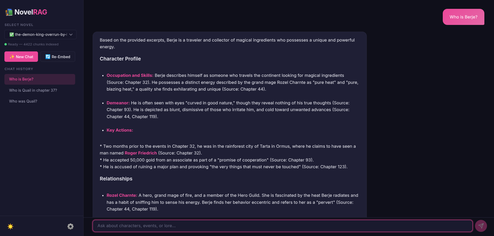

# 📚 Novel-RAG: The Expert Lore-Keeper

**Novel-RAG** is a specialized Retrieval-Augmented Generation system built to navigate the complexities of long-form fiction. While standard RAG often struggles with character pronouns and evolving plot points, this system uses strategic chunking and high-precision retrieval to provide accurate answers about character relationships, past events, and hidden lore.




### Core Capabilities:
*   📖 **Deep Novel Indexing**: Process hundreds of markdown chapters into a persistent local vector database.
*   🤝 **Relationship Mapping**: Designed specifically to track "Who did what to whom" across 500,000+ words.
*   ⚡ **Hybrid Embeddings**: Switch between local `sentence-transformers` for privacy/cost and Gemini API for maximum accuracy.
*   🛡️ **Anti-Hallucination**: Restrictive prompting ensures the AI acts as a historian, not a co-author, citing its sources for every claim.
*   🌐 **Web Interface**: Modern chat UI with streaming responses, session history, and a settings panel.
*   🐳 **Docker-Ready**: One command to build and run the entire application.

---

## 🚀 Quick Start Guide

### Option A: Docker (Recommended)

The easiest way to run Novel RAG — everything is containerized.

```bash
# 1. Clone the repository
git clone https://github.com/your-username/novel_rag.git
cd novel_rag

# 2. Create your .env file with your API key
cp .env.example .env
# Edit .env and add your GEMINI_API_KEY

# 3. Add your novels (markdown chapters in subfolders of data/)
mkdir -p data/my-novel
# Copy your .md chapter files into data/my-novel/

# 4. Build and run
docker compose up -d

# 5. Open your browser
# http://localhost:8000
```

### Option B: Bare Metal (Python 3.12+)

```bash
# 1. Create and activate virtual environment
python -m venv .venv
source .venv/bin/activate  # Or `.venv\Scripts\activate` on Windows

# 2. Install dependencies
pip install -r requirements.txt

# 3. Configure
cp .env.example .env
# Edit .env and add your GEMINI_API_KEY

# 4. Add your novels to data/
mkdir -p data/my-novel
# Copy .md files into data/my-novel/

# 5a. Run the Web UI
uvicorn src.main:app --host 0.0.0.0 --port 8000 --reload
# Open http://localhost:8000

# 5b. Or run the CLI (original terminal mode)
python -m src.cli
```

---

## 📱 Using the Web Interface

### 1. Select a Novel
Choose a novel from the sidebar dropdown. The status indicator shows whether embeddings exist.

### 2. First-Time Embedding
If a novel hasn't been processed yet, click **Re-Embed**. A progress bar shows real-time embedding progress via WebSocket.

### 3. Chat
Click **New Chat** to start asking questions. Responses stream in token-by-token — no waiting for the full answer.

### 4. Chat History
Previous chats appear in the sidebar. Click any session to resume it. Sessions auto-title from your first message.

### 5. Settings
Click the ⚙️ gear icon to change:
- **API Key** — your Gemini API key (stored securely, masked in the UI)
- **Generation Model** — which Gemini model generates answers
- **Embedding Mode** — Local (HuggingFace, free) or API (Gemini, accurate)
- **Model Names** — customize embedding model names

### 6. Theme
Toggle between light and dark mode with the 🌙/☀️ button. Your preference is saved in the browser.

---

## 🔁 Use Cases & Updating Data

### How to add entirely new novels
Create a new folder in `data/` and add your `.md` files. The novel appears in the dropdown on next page load.

### How to add new chapters to an existing novel
Drop new `.md` files into the novel's folder, then click **Re-Embed** in the UI (or type `!reingest` in CLI mode).

---

## 🧪 Running Tests

```bash
# Run the full test suite
python -m pytest tests/ -v

# Run specific test files
python -m pytest tests/test_document_processor.py -v
python -m pytest tests/test_chat_store.py -v
python -m pytest tests/test_api.py -v
python -m pytest tests/test_settings.py -v
```

Tests run automatically on every push/PR via GitHub Actions CI/CD.

---

## 🧠 Educational Details: How This Works

This application is split into highly modular parts so you can study exactly how the data flows. For a deep dive, see the **dedicated documentation**:

| Document | What It Covers |
|----------|---------------|
| [**Architecture Guide**](docs/ARCHITECTURE.md) | System diagrams, design decisions, patterns, and rationale |
| [**WebSocket Guide**](docs/WEBSOCKETS.md) | Streaming protocol, annotated code, connection lifecycle |

### Quick Overview

1. **Chunking** (`src/core/document_processor.py`) — Chapters are split into ~600-char overlapping chunks using a sliding window. The 150-char overlap prevents pronoun references from being lost between chunks.

2. **Embeddings** (`src/core/embeddings.py`) — Text chunks are converted to numerical vectors (arrays of floats). You can switch between free local embeddings (HuggingFace) and paid Gemini API embeddings.

3. **Vector Database** (`src/core/vector_db.py`) — ChromaDB stores text alongside its embedding vector. When you ask a question, it finds the mathematically nearest chunks.

4. **Generation** (`src/api/routes.py`) — The 7 most relevant chunks are injected into a carefully engineered prompt, and Gemini generates an answer citing its sources.

5. **Streaming** — Responses stream token-by-token via WebSocket, so you see the answer being written in real-time.

---

## 📁 Project Structure

```
novel_rag/
├── src/
│   ├── core/                    # Core RAG engine (framework-independent)
│   │   ├── config.py            # Settings manager with 3-tier priority
│   │   ├── document_processor.py # Chapter chunking algorithm
│   │   ├── embeddings.py        # Text-to-vector conversion
│   │   ├── vector_db.py         # ChromaDB wrapper
│   │   └── utils.py             # Logging and timing utilities
│   ├── api/                     # FastAPI web layer
│   │   ├── routes.py            # REST + WebSocket endpoints
│   │   └── chat_store.py        # SQLite session persistence
│   ├── main.py                  # FastAPI app entry point
│   └── cli.py                   # Original terminal interface
├── frontend/                    # Vanilla HTML/CSS/JS chat UI
│   ├── index.html
│   ├── style.css
│   └── app.js
├── tests/                       # Test suite (39 tests)
├── docs/                        # Architecture & WebSocket documentation
├── data/                        # Your novel chapters (gitignored)
├── db/                          # ChromaDB + SQLite data (gitignored)
├── Dockerfile                   # Container build instructions
├── docker-compose.yml           # Service orchestration
├── .github/workflows/ci.yml     # CI/CD pipeline
└── requirements.txt             # Python dependencies
```

---

## 💡 Suggested Future Features

1. **Multi-modal RAG** — Support images/illustrations embedded in novel chapters
2. **Chapter-level filtering** — Ask questions scoped to specific chapters
3. **Export conversations** — Download chat history as Markdown
4. **Authentication** — Multi-user support with login
5. **Novel upload via UI** — Drag-and-drop `.md` files
6. **Semantic search UI** — Show retrieved chunks alongside the answer for transparency
7. **Chunk visualization** — Interactive view of how a chapter was split
8. **Comparison mode** — Compare lore across multiple novels side-by-side

---

## 📜 License & Acknowledgments
This project is licensed under the MIT License.

*This repository was built using an AI-assisted "vibe coding" approach—focusing on rapid iteration, intuitive flow, and collaborative generation to bridge the gap between idea and implementation.*
