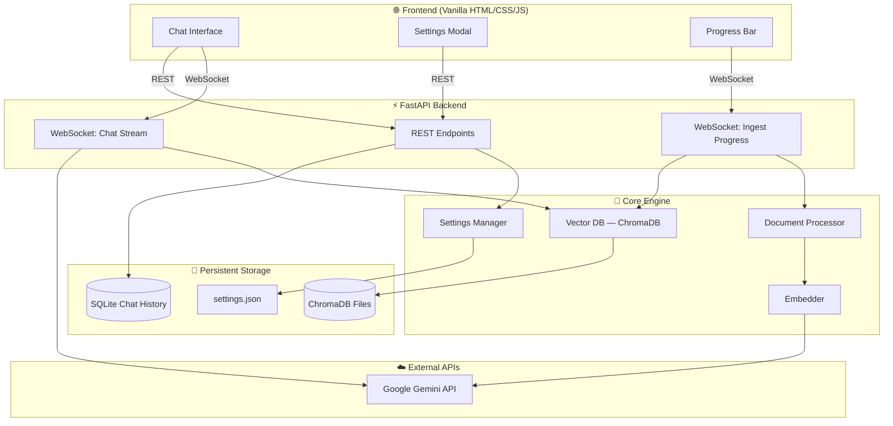
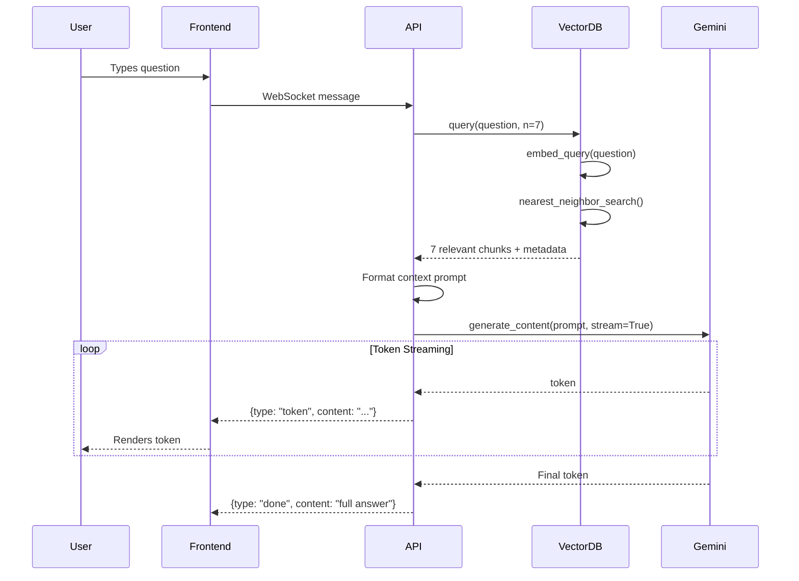

# 🏗️ Architecture Guide — Novel RAG

This document explains the **design decisions, patterns, and architecture** behind Novel RAG. It's written for developers who want to understand *why* things are built the way they are, not just *how* they work.

---

## System Overview



---

## Why FastAPI?

We chose FastAPI over Flask, Django, or Express for several reasons:

| Feature | FastAPI | Flask | Django |
|---------|---------|-------|--------|
| Async support | ✅ Native | ❌ Requires extensions | ⚠️ Limited |
| WebSocket support | ✅ Built-in | ❌ Requires Socket.IO | ❌ Channels needed |
| Auto API docs | ✅ Swagger + ReDoc | ❌ Manual | ❌ Manual |
| Type validation | ✅ Pydantic | ❌ Manual | ⚠️ Forms/Serializers |
| Learning curve | Low | Low | High |

**Key reasons:**
1. **Native WebSocket support** — critical for streaming LLM responses and ingestion progress
2. **Automatic API documentation** — visit `/docs` to see interactive Swagger UI
3. **Pydantic validation** — request bodies are validated automatically from type hints
4. **Async by default** — perfect for I/O-bound work like API calls and database queries

---

## Why Vanilla HTML/CSS/JS?

No React. No Vue. No build tools. Pure web fundamentals.

**Rationale:**
1. **Zero build complexity** — no `npm install`, no webpack, no transpilation
2. **Educational** — learn how the web actually works, not framework abstractions
3. **Lightweight** — the entire frontend is ~30KB, loads instantly
4. **Debuggable** — open DevTools, see the real code, no source maps needed

**The trade-off:** For a larger app with many interactive components, a framework would reduce code duplication. But for a single-page chat interface, vanilla JS is perfectly sufficient.

---

## Why SQLite for Chat History?

| Feature | SQLite | PostgreSQL | MongoDB |
|---------|--------|------------|---------|
| Setup required | None (Python built-in) | Server installation | Server installation |
| File count | 1 file | Many files + server | Many files + server |
| Perfect for | Single-user, embedded | Multi-user, production | Document-heavy apps |
| Backup | Copy one file | pg_dump | mongodump |

SQLite is ideal here because:
- **Zero config** — `import sqlite3` and you're done
- **Single file** — the entire chat history is one `.sqlite3` file
- **ACID compliant** — data is safe even if the app crashes
- **Embeddable** — runs in-process, no separate database server

---

## Configuration Hierarchy

Settings follow a 3-tier priority system (highest wins):

```
┌─────────────────────────┐
│  3. settings.json       │  ← User changed via Settings UI
│     (highest priority)  │
├─────────────────────────┤
│  2. .env file           │  ← Set at deploy time / Docker
├─────────────────────────┤
│  1. Hardcoded defaults  │  ← Fallback values in config.py
│     (lowest priority)   │
└─────────────────────────┘
```

**Why this design?**
- **Defaults** ensure the app always starts, even with zero configuration
- **.env files** are the standard for injecting secrets in Docker/CI environments
- **settings.json** enables runtime changes without restarting the container

---

## Design Patterns Used

### 1. Repository Pattern (ChatStore)
The `ChatStore` class hides all SQL behind clean Python methods. Routes never write SQL — they call `create_session()`, `add_message()`, etc. If you swap SQLite for PostgreSQL, only `chat_store.py` changes.

### 2. Service Layer (Core Engine)
The `src/core/` package acts as a service layer — it contains all business logic (chunking, embedding, retrieval) independent of the interface (CLI or web). Both `cli.py` and `routes.py` import from `core/`.

### 3. Configuration Object (SettingsManager)
Instead of scattering `os.getenv()` calls throughout the code, `SettingsManager` centralizes all config reads. Any module can call `config.settings.get("key")`.

### 4. Observer Pattern (Progress Callback)
During ingestion, `VectorDB.store_documents()` accepts a `progress_callback` function. The WebSocket handler passes a callback that sends progress updates to the browser. The VectorDB doesn't know about WebSockets — it just calls the function.

---

## RAG Pipeline — End to End



---

## Suggested Future Features

1. **Multi-modal RAG** — support images/illustrations embedded in novel chapters
2. **Chapter-level filtering** — scope questions to specific chapters
3. **Export conversations** — download chat history as Markdown
4. **Authentication** — multi-user support with login
5. **Novel upload via UI** — drag-and-drop `.md` files
6. **Semantic search UI** — show retrieved chunks alongside the answer
7. **Chunk visualization** — interactive view of how chapters are split
8. **Comparison mode** — compare lore across multiple novels side-by-side
9. **RAG evaluation** — automated accuracy testing with known Q&A pairs
