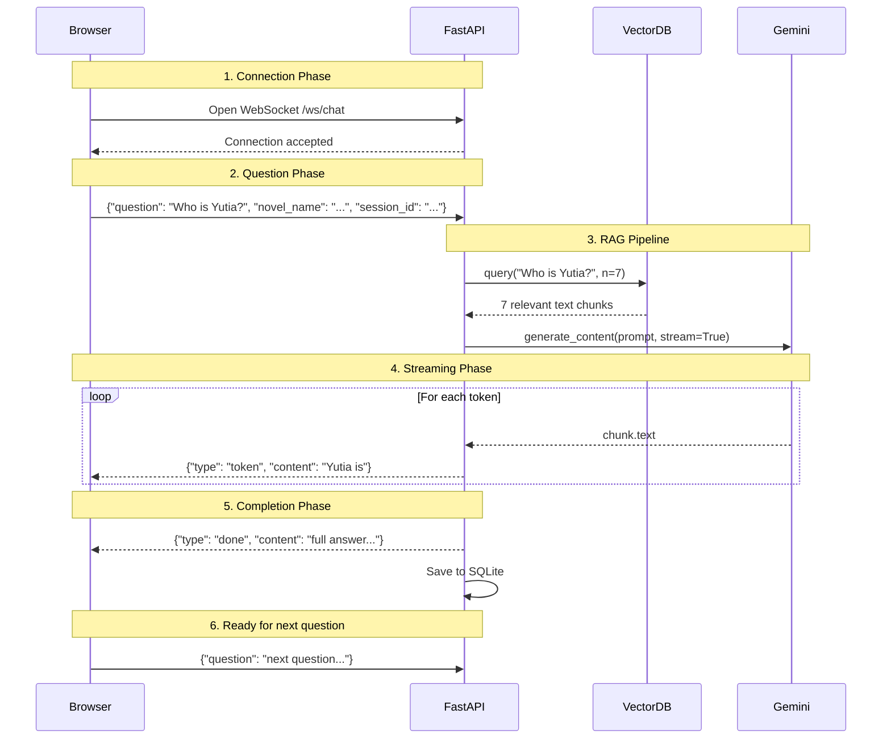
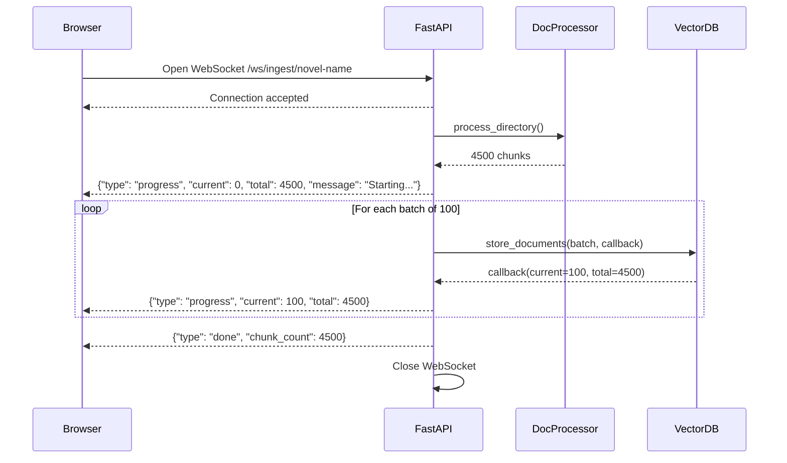
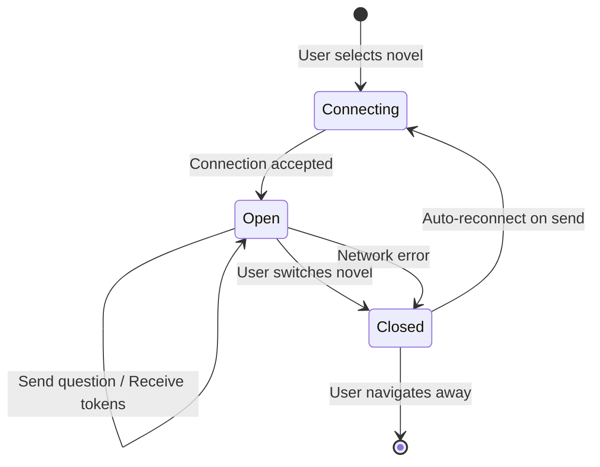

# 🔌 WebSocket Guide — Streaming in Novel RAG

This document is a deep-dive into how Novel RAG uses WebSockets for **real-time streaming**. It covers the protocol design, implementation details, and the reasoning behind architectural choices.

---

## Why WebSockets?

### The Problem with HTTP for Streaming

Traditional HTTP follows a **request-response** model:

```
Client: "Hey server, here's my question"
Server: [thinks for 10 seconds...]
Server: "Here's the complete answer"
Client: [finally gets to read something]
```

For LLM responses that take 5-30 seconds to generate, this means the user stares at a loading spinner the entire time. The answer arrives all at once, fully formed.

### How WebSockets Solve This

WebSockets create a **persistent, bidirectional** connection:

```
Client: [opens WebSocket connection]
Client: "Here's my question"
Server: "The"           ← 100ms later
Server: " answer"       ← 200ms later  
Server: " is"           ← 300ms later
Server: " streaming!"   ← 400ms later
Server: {type: "done"}  ← stream complete
```

The user sees text appearing word-by-word, exactly like ChatGPT. This dramatically improves perceived performance.

### WebSocket vs Server-Sent Events (SSE)

| Feature | WebSocket | SSE |
|---------|-----------|-----|
| Direction | Bidirectional | Server → Client only |
| Protocol | `ws://` / `wss://` | Regular HTTP |
| Browser support | Universal | Universal |
| Reconnection | Manual | Automatic |
| Binary data | ✅ | ❌ |

**Why we chose WebSocket over SSE:**
1. **Bidirectional** — the client sends questions AND receives answers on the same connection
2. **Connection reuse** — one WebSocket handles multiple Q&A cycles (SSE would need a new request per question)
3. **FastAPI native** — FastAPI has first-class WebSocket support built in

---

## Architecture Diagram



---

## Ingestion Progress Flow



---

## Protocol Design

### Chat WebSocket (`/ws/chat`)

**Client → Server (JSON):**
```json
{
    "question": "Who is the demon king?",
    "novel_name": "became-the-patron-of-villains",
    "session_id": "uuid-here"
}
```

**Server → Client (JSON) — three message types:**

```json
// Token: partial streaming content
{"type": "token", "content": "The demon"}

// Done: streaming complete, full answer
{"type": "done", "content": "The demon king is...", "session_id": "uuid"}

// Error: something failed
{"type": "error", "content": "API key invalid"}
```

### Ingest WebSocket (`/ws/ingest/{novel_name}`)

**No client message needed** — the server starts immediately.

**Server → Client (JSON):**
```json
// Progress update
{"type": "progress", "current": 150, "total": 4500, "message": "Batch 2/45"}

// Complete
{"type": "done", "message": "Ingestion complete!", "chunk_count": 4500}

// Error
{"type": "error", "content": "No markdown files found"}
```

---

## Server Implementation Walkthrough

### Key snippet from `routes.py` — Streaming Chat:

```python
@router.websocket("/ws/chat")
async def websocket_chat(ws: WebSocket):
    await ws.accept()  # Accept the connection

    while True:  # Keep alive for multiple questions
        raw = await ws.receive_text()        # Wait for question
        data = json.loads(raw)

        # ... RAG retrieval happens here ...

        # Stream=True makes Gemini return an iterator
        response = model.generate_content(prompt, stream=True)

        for chunk in response:
            if chunk.text:
                # Send each token immediately
                await ws.send_json({
                    "type": "token",
                    "content": chunk.text
                })
                # Yield to event loop so buffer flushes
                await asyncio.sleep(0)

        # Signal completion
        await ws.send_json({"type": "done", "content": full_answer})
```

**Why `await asyncio.sleep(0)`?**  
FastAPI runs on an async event loop. Without yielding control between tokens, the WebSocket buffer might accumulate multiple tokens before flushing. `sleep(0)` forces the event loop to process pending I/O (including sending the WebSocket frame), ensuring tokens reach the browser immediately.

### Key snippet — Progress Callback from Thread:

```python
# The challenge: VectorDB.store_documents() is blocking (CPU-bound)
# but WebSocket.send_json() is async. They can't directly call each other.

loop = asyncio.get_event_loop()

def progress_callback(current, total, message):
    # schedule the async send from within the blocking thread
    future = asyncio.run_coroutine_threadsafe(
        ws.send_json({"type": "progress", ...}),
        loop
    )
    future.result(timeout=10)  # Wait for send to complete

# Run blocking work in a thread pool
await asyncio.to_thread(db.store_documents, documents, progress_callback)
```

**Why `asyncio.run_coroutine_threadsafe`?**  
When we run `store_documents` in a thread pool (via `asyncio.to_thread`), the progress callback executes in that thread — not the main async event loop thread. We can't directly `await` an async function from a sync thread. `run_coroutine_threadsafe` bridges this gap by scheduling the coroutine on the event loop from outside the loop's thread.

---

## Client Implementation Walkthrough

### Key snippet from `app.js` — Handling Streaming:

```javascript
const WS = {
    connectChat() {
        const protocol = location.protocol === 'https:' ? 'wss:' : 'ws:';
        const ws = new WebSocket(`${protocol}//${location.host}/ws/chat`);

        ws.onmessage = (event) => {
            const data = JSON.parse(event.data);

            switch (data.type) {
                case 'token':
                    // Append to streaming bubble (don't create a new one!)
                    state.streamBuffer += data.content;
                    const bubble = getOrCreateStreamBubble();
                    bubble.innerHTML = renderMarkdown(state.streamBuffer);
                    scrollToBottom();
                    break;

                case 'done':
                    // Finalize: remove streaming ID, save to state
                    streamBubble.removeAttribute('id');
                    state.messages.push({
                        role: 'assistant',
                        content: data.content
                    });
                    break;

                case 'error':
                    appendMessage('assistant', `⚠️ ${data.content}`);
                    break;
            }
        };
    }
};
```

**The Streaming Bubble Pattern:**  
During streaming, we don't create a new DOM element for each token (that would be thousands of elements). Instead, we maintain a single "streaming bubble" with `id="streaming-bubble"`. Each token replaces the bubble's `innerHTML` with the full accumulated text so far. When streaming completes, we remove the ID so it becomes a permanent message.

---

## Connection Lifecycle & Reconnection



**Reconnection strategy:**  
If the WebSocket disconnects (network error, server restart), the next `sendQuestion()` call detects the closed connection and triggers `connectChat()` to establish a new one. This is simpler than background heartbeat-based reconnection and works well for a single-user app.

---

## Testing WebSockets

FastAPI's `TestClient` supports WebSocket testing:

```python
def test_chat_missing_fields(test_client):
    with test_client.websocket_connect("/ws/chat") as ws:
        ws.send_json({"novel_name": "test"})  # Missing 'question'
        response = ws.receive_json()
        assert response["type"] == "error"
```

For integration testing with real streaming, you'd use `websockets` library:

```python
import websockets

async def test_full_stream():
    async with websockets.connect("ws://localhost:8000/ws/chat") as ws:
        await ws.send(json.dumps({
            "question": "Who is Yutia?",
            "novel_name": "my-novel",
            "session_id": "test-session"
        }))

        tokens = []
        async for message in ws:
            data = json.loads(message)
            if data["type"] == "token":
                tokens.append(data["content"])
            elif data["type"] == "done":
                break

        full_answer = "".join(tokens)
        assert len(full_answer) > 0
```
